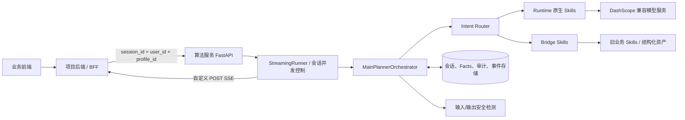

# 升学顾问大模型算法后端：整体架构

> 本文描述当前代码实际运行的算法服务，以及它与项目 BFF、前端和模型服务的边界。对外 API 与前端交互见 [API_DOCUMENTATION.md](../../guides/API_DOCUMENTATION.md)。更深入的路由细节见 [current_conversation_flow.md](current_conversation_flow.md)。

## 1. 定位与边界

这是一个面向升学咨询的状态型 Agent/Skill 后端，不是把用户文本直接转给大模型的薄代理。它负责：会话、三层 Facts、意图路由、Skill 执行、业务资产查询、内容安全、消息持久化和自定义 SSE 输出。



职责划分：

| 层 | 负责 | 不负责 |
| --- | --- | --- |
| 前端 | 交互、表单、Markdown/SSE 渲染 | `user_id`、模型密钥、算法端口 |
| 项目 BFF | 登录校验、资源归属、可信内网调用、HTTP/SSE 转发 | 改写算法业务响应或 SSE |
| 算法服务 | 会话、Facts、路由、Skills、安全、结构化输出 | 企业账户体系、浏览器鉴权 |
| 模型服务 | 文本/推理/embedding 推理 | 业务状态和用户资源权限 |

## 2. 模块结构

```text
src/hailiang_skills/
  api/              FastAPI 入口、chat/profile/facts 路由
  core/             SessionContext、Facts、StreamingRunner、交互状态、并发、日志/指标
  runtime_bridge/   Hailiang 状态与 skill-runtime 的双向适配；主编排器
  skill_runtime/    runtime Skill 加载、Intent Router、工具、Prompt、运行状态
  skills/           原有规则/业务 Skill（admission、convergence 等）
  llm/              模型客户端、配置、Prompt registry
  storage/          文件/数据库仓储、审计、事件存储
  security/         输入/输出审核、隔离区

runtime_skills/<skill>/
  SKILL.md                 能力、路由 metadata、提示词约束
  runtime_contract.json    stage、facts、路由和运行时契约
  assets/ references/ scripts/ 该 Skill 的结构化资产、知识、工具脚本
```

## 3. 两条执行路径

当前生产主路径是 `MainPlannerOrchestrator`；旧的 `RouterSkill -> FactsExtractorSkill -> PlannerSkill` 链路仍保留为兼容和桥接 fallback，不是默认主入口。

| 类型 | 典型 Skill | 执行方式 |
| --- | --- | --- |
| runtime 原生 | `career_plan_entity`、`subject_advisor`、`score_improve`、`interest_explore`、`future_explore`、`junior_multi_path_planning` | Skill runtime 读取契约、资料/工具并调用模型；`career_plan_entity` 由 `general_chat` 推荐或工具栏进入 |
| bridge | `mock_admission -> admission`、`multi_path_planning -> convergence` | runtime 完成路由，旧业务 Skill 完成规则、资产与结果生成 |
| general chat | `general_chat` | 不命中升学专项时的自由问答入口 |

`target_skill`（路由目标）和 `active_skill`（实际执行者）可能不同；例如 `mock_admission -> admission`。前端、日志和排障要同时保留这两个字段。

## 4. 一轮请求的真实处理流程

```text
1. BFF 校验用户与资源归属 -> 传入 session_id、user_id、profile_id 到算法 API
2. API 按会话标识加载或恢复状态；访问边界由 BFF 与内网策略保障
3. StreamingRunner 为 session 申请本轮执行租约，防止并发覆盖
4. 读取 shared/profile/session Facts，合成 effective_facts
5. 输入安全检测；拦截则结束本轮
6. MainPlannerOrchestrator 恢复 runtime SessionState，并同步 effective_facts
7. Intent Router 决策：显式目标 > 恢复 > 学段门控 > 显式场景 > 规则 > 文本/向量匹配 > LLM 兜底
8. 执行 runtime 原生 Skill 或 bridge Skill；按需调用模型、脚本和结构化资产
9. 将 runtime Facts/状态写回 Hailiang SessionContext；生成候选路径、表单、引用和路由建议
10. 输出安全检测、持久化消息/Facts/事件/审计
11. 返回同步 JSON，或通过 SSE 按增量推送文本、状态和结构化块
```

## 5. 状态与数据模型

### 5.1 资源归属

```text
user_id
  └─ profile_id（孩子档案）
       └─ session_id（对话会话）
            └─ messages / interaction_states / event_trace
```

### 5.2 Facts

```text
shared_facts（家庭） + profile_facts（孩子） + session_facts（本次会话）
                         -> effective_facts
优先级：session > profile > shared
```

Runtime 同时维护 `SessionState.global_facts / skill_facts / stage_facts / status_flags / route_history`。每轮前将 `effective_facts` 同步进 `global_facts`，执行后再写回三层 Facts 和会话状态。

### 5.3 消息可操作状态

每个助手消息可持久化 `interaction_states`：

- `fact_form:{form_id}`：`active -> submitted/expired`
- `route_suggestions`：`active -> selected/expired`
- `path_actions`：通常随新消息过期

这让历史恢复后仍能正确显示“已完成/已选择/已失效”，而不是只依赖前端内存。

## 6. 输出协议：不是 OpenAI 直通流

算法服务内部可用 DashScope 的 OpenAI-compatible 接口，但前端协议是自定义 POST SSE。关键事件为：

```text
run_started -> skill_context -> skill_status* -> reasoning_delta* -> final_text_delta*
            -> main_content_end -> fact_changes? -> skill_action? -> message_block*
            -> final_message -> run_completed
```

其中 `final_message` 是本轮权威快照，包含主回复、`message_blocks`、Facts、Skill 状态和 `route_suggestions`。结构化块负责驱动 `fact_form`、`path_actions`、`citations`、`status_timeline`、`markdown` 等 UI，而不是由模型输出不稳定的页面 HTML。

## 7. 安全、可靠性与观测

| 能力 | 当前原则 |
| --- | --- |
| 身份 | BFF 解析用户身份与资源归属；算法服务仅接受可信内网调用 |
| 内容安全 | 输入、流中/输出阶段审核；命中后同步返回 `422` 或流内 `moderation_blocked` |
| 并发 | 同一会话使用 turn lease/generation 防止旧流覆盖新流；容量不足返回 `429` |
| 流式取消 | 浏览器/BFF 断连会标记当前 generation 取消，避免继续持久化旧结果 |
| 可观测性 | `X-Request-Id`、`traceparent`、事件日志、指标、审计记录串联一次请求 |
| 隐私 | 不在普通日志写入原始敏感输入、Token 或模型密钥；安全隔离区需额外授权 |

## 8. 部署拓扑与上线前约束

```text
公网浏览器
  -> HTTPS 项目域名 / BFF
  -> 私网算法服务（FastAPI）
  -> 模型网关 / DashScope
  -> PostgreSQL 或受控持久化（会话、Facts、审计、事件）
```

- 算法服务端口不应暴露给公网或浏览器。
- BFF 对 SSE 必须关闭缓冲/压缩，立即转发 `event:` 和 `data:`，并把下游取消传到上游。
- 当前消息请求没有幂等键，也不支持 SSE 断点续传；收到事件后不可自动重放，断线后从 `/context` 恢复。
- 上线多实例前必须使用共享持久化，并统一会话归属映射和版本冲突策略；不能依赖单机内存。

## 9. 当前技术债与推荐收敛方向

1. 路由 metadata 目前散落在 `runtime_contract.json`、`SKILL.md`、`SCENE_HINTS` 和旧配置中；应逐步收敛到 runtime contract + Skill metadata。
2. 旧链路与新 runtime 主链路并存；新功能优先接入 `MainPlannerOrchestrator`，旧链路只保留 bridge/兼容职责。
3. `target_skill`、`active_skill`、展示名称需作为不同概念对外记录，避免桥接场景排障歧义。
4. 将会话、Facts、事件和审计统一迁移到共享数据库，并增加迁移、备份、过期清理和多实例压测。
